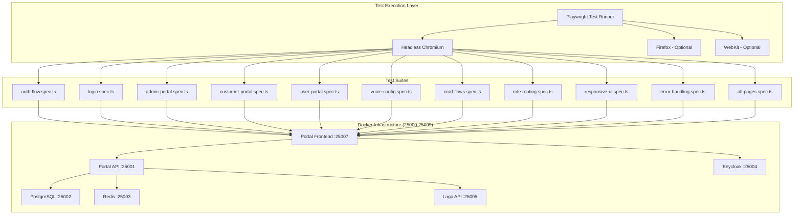

# Design Document: E2E Testing Infrastructure

## Overview

This document describes the technical design for the comprehensive End-to-End (E2E) testing infrastructure for the AgentVoiceBox Portal Frontend. The test suite uses Playwright to validate all GUI flows across three portal experiences (Admin, Customer, User) against real Docker infrastructure running on port range 25000-25099.

## Architecture



## Components and Interfaces

### 1. Playwright Configuration (`playwright.config.ts`)

```typescript
interface PlaywrightConfig {
  testDir: string;           // './e2e'
  fullyParallel: boolean;    // false for sequential execution
  retries: number;           // 2 in CI, 1 locally
  workers: number;           // 1 in CI, 2 locally
  timeout: number;           // 60000ms
  use: {
    baseURL: string;         // 'http://localhost:25007'
    headless: boolean;       // true by default
    trace: string;           // 'on-first-retry'
    screenshot: string;      // 'only-on-failure'
    video: string;           // 'on-first-retry'
  };
  projects: BrowserProject[];
}
```

### 2. Test Suite Structure

| Suite | File | Purpose | Test Count |
|-------|------|---------|------------|
| Login | `login.spec.ts` | Login page rendering, SSO flow | 17 |
| Auth Flow | `auth-flow.spec.ts` | Authentication, protected routes | 14 |
| All Pages | `all-pages.spec.ts` | Unified layout verification | 8 |
| Admin Portal | `admin-portal.spec.ts` | SaaS Admin flows | 18 |
| Customer Portal | `customer-portal.spec.ts` | Tenant Admin flows | 35 |
| User Portal | `user-portal.spec.ts` | End user flows | 16 |
| Voice Config | `voice-config.spec.ts` | Voice configuration | 28 |
| CRUD Flows | `crud-flows.spec.ts` | Entity CRUD operations | 20 |
| Role Routing | `role-routing.spec.ts` | Permission-based routing | 22 |
| Responsive UI | `responsive-ui.spec.ts` | Mobile/tablet/desktop | 18 |
| Error Handling | `error-handling.spec.ts` | Error states | 20 |

### 3. Test Utilities

```typescript
// Page Object Model interfaces
interface AdminDashboardPage {
  navigateTo(): Promise<void>;
  getMetricCards(): Promise<MetricCard[]>;
  selectTimePeriod(period: '7d' | '30d' | '90d'): Promise<void>;
  waitForRefresh(): Promise<void>;
}

interface CustomerDashboardPage {
  navigateTo(): Promise<void>;
  getUsageMetrics(): Promise<UsageMetrics>;
  clickRefresh(): Promise<void>;
  getProgressBars(): Promise<ProgressBar[]>;
}

interface APIKeysPage {
  navigateTo(): Promise<void>;
  clickCreateKey(): Promise<void>;
  fillKeyName(name: string): Promise<void>;
  selectScopes(scopes: string[]): Promise<void>;
  submitCreate(): Promise<string>; // Returns key secret
  getKeyList(): Promise<APIKey[]>;
  rotateKey(keyId: string): Promise<string>;
  revokeKey(keyId: string): Promise<void>;
}
```

## Data Models

### Test Configuration

```typescript
interface TestEnvironment {
  baseURL: string;           // Docker cluster URL
  keycloakURL: string;       // Keycloak auth URL
  apiURL: string;            // Portal API URL
  timeout: number;           // Default timeout
  retries: number;           // Retry count
}

interface TestUser {
  email: string;
  password: string;
  role: 'admin' | 'tenant_admin' | 'user';
  tenantId?: string;
}

interface ViewportConfig {
  mobile: { width: 375, height: 667 };
  tablet: { width: 768, height: 1024 };
  desktop: { width: 1920, height: 1080 };
}
```

### Test Artifacts

```typescript
interface TestArtifacts {
  screenshots: string[];     // Failure screenshots
  traces: string[];          // Playwright traces
  videos: string[];          // Test videos
  reports: {
    html: string;            // HTML report path
    json: string;            // JSON results path
  };
}
```

## Correctness Properties

*A property is a characteristic or behavior that should hold true across all valid executions of a system-essentially, a formal statement about what the system should do. Properties serve as the bridge between human-readable specifications and machine-verifiable correctness guarantees.*

### Property 1: Protected Route Access Control
*For any* protected route and any unauthenticated user, navigating to that route SHALL redirect to the Keycloak login page.
**Validates: Requirements 1.1, 10.4, 11.1**

### Property 2: API Key Secret Masking
*For any* API key displayed in the key list, the System SHALL show only the key prefix with masking (e.g., `avb_abc...`) and SHALL NOT display the full secret value.
**Validates: Requirements 6.1**

### Property 3: Search Filter Consistency
*For any* search query entered in tenant management, the System SHALL return only tenants whose name, email, or ID contains the search term.
**Validates: Requirements 3.2**

### Property 4: Session Status Filter Accuracy
*For any* status filter selected (all, active, closed), the System SHALL display only sessions matching the selected status.
**Validates: Requirements 5.2**

### Property 5: User Session Isolation
*For any* user viewing the sessions page, the System SHALL display only sessions belonging to that user's tenant context.
**Validates: Requirements 10.2**

### Property 6: Error Response Handling
*For any* API error response (4xx or 5xx), the System SHALL display a user-friendly error message and SHALL NOT expose raw error details.
**Validates: Requirements 13.1, 13.2, 13.3**

### Property 7: Form Validation Feedback
*For any* form with invalid input, the System SHALL highlight the invalid fields and display specific error messages before allowing submission.
**Validates: Requirements 13.4**

### Property 8: CRUD Entity Persistence
*For any* valid entity creation request, the System SHALL persist the entity and display it in the entity list after successful creation.
**Validates: Requirements 14.1**

### Property 9: Role-Based Dashboard Routing
*For any* authenticated user, the System SHALL route the user to the appropriate dashboard based on their role: admin users to `/admin/dashboard`, tenant_admin users to `/dashboard`, and regular users to `/app`.
**Validates: Requirements 1.2, 1.3, 1.4, 1.5**

### Property 10: Role-Based Navigation Visibility
*For any* user viewing the sidebar navigation, the System SHALL display only navigation items permitted for their role: admin users see all items, tenant_admin users see customer portal items, and regular users see limited user portal items.
**Validates: Requirements 11.2, 11.3, 11.4**

### Property 11: Role-Based Action Permissions
*For any* action button (create, edit, delete, revoke), the System SHALL display the button only if the current user's role has permission to perform that action. Regular users SHALL NOT see create/edit/delete buttons on shared resources.
**Validates: Requirements 10.3, 10.4**

### Property 12: Cross-Portal Access Prevention
*For any* user attempting to access a portal route above their permission level (e.g., regular user accessing admin routes), the System SHALL redirect to their appropriate portal with an access denied indication.
**Validates: Requirements 11.1, 11.3**

### Property 13: Tenant Context Isolation
*For any* tenant_admin or user viewing data, the System SHALL display only data belonging to their tenant. Data from other tenants SHALL NOT be visible regardless of direct URL access attempts.
**Validates: Requirements 10.2, 5.2**

### Property 14: Admin Elevated Access
*For any* admin user, the System SHALL allow access to all portal routes (admin, customer, user) with full visibility of cross-tenant data for platform management purposes.
**Validates: Requirements 11.2**

## Error Handling

### Network Errors
- Display error message with retry button
- Preserve user input during retry
- Log error details for debugging

### Authentication Errors
- 401: Redirect to login page
- 403: Display access denied message
- Session expiry: Redirect with session_expired parameter

### Validation Errors
- Inline field validation with specific messages
- Disable submit button until valid
- Preserve form state on validation failure

### Loading States
- Skeleton loaders for initial page load
- Spinner for button actions
- Disable duplicate submissions

## Testing Strategy

### Dual Testing Approach

The E2E test suite employs both example-based tests and property-based verification:

1. **Example-Based Tests**: Verify specific user journeys and UI interactions
2. **Property-Based Tests**: Verify universal behaviors that should hold across all inputs

### Test Framework

- **Framework**: Playwright Test
- **Browser**: Headless Chromium (primary), Firefox and WebKit (cross-browser)
- **Assertions**: Playwright's built-in expect assertions
- **Reporting**: HTML report + JSON results

### Test Execution Modes

```bash
# Default: Headless Chromium
npx playwright test

# Headed mode for debugging
npx playwright test --headed

# Specific browser
npx playwright test --project=chromium

# Cross-browser
npx playwright test --project=chromium --project=firefox --project=webkit

# Single test file
npx playwright test e2e/admin-portal.spec.ts

# With UI mode
npx playwright test --ui
```

### CI/CD Configuration

```yaml
# GitHub Actions example
- name: Run E2E Tests
  run: |
    cd portal-frontend
    npx playwright install --with-deps chromium
    npx playwright test --project=chromium
  env:
    E2E_BASE_URL: http://localhost:25007
    CI: true
```

### Test Tagging Convention

Each test is tagged with the requirement it validates:

```typescript
test('should display admin dashboard with key metrics', async ({ page }) => {
  // Requirements A1.1: Display usage metrics
  // **Feature: e2e-testing-infrastructure, Property 1: Protected Route Access Control**
  await expect(page.getByText(/total tenants/i)).toBeVisible();
});
```

### Minimum Iterations

Property-based tests should run a minimum of 100 iterations to ensure adequate coverage of the input space.

## Docker Infrastructure Dependencies

| Service | Port | Purpose |
|---------|------|---------|
| Portal Frontend | 25007 | Next.js application under test |
| Portal API | 25001 | Backend API |
| Keycloak | 25004 | Authentication |
| PostgreSQL | 25002 | Database |
| Redis | 25003 | Session cache |
| Lago API | 25005 | Billing |
| Lago Frontend | 25006 | Billing UI |
| Prometheus | 25008 | Metrics |
| Grafana | 25009 | Dashboards |
| OVOS Messagebus | 25010 | Voice agent |
| Vault | 25012 | Secrets |

## File Structure

```
portal-frontend/
├── e2e/
│   ├── login.spec.ts           # Login page tests
│   ├── auth-flow.spec.ts       # Authentication flow tests
│   ├── all-pages.spec.ts       # Layout verification tests
│   ├── admin-portal.spec.ts    # Admin portal tests
│   ├── customer-portal.spec.ts # Customer portal tests
│   ├── user-portal.spec.ts     # User portal tests
│   ├── voice-config.spec.ts    # Voice configuration tests
│   ├── crud-flows.spec.ts      # CRUD operation tests
│   ├── role-routing.spec.ts    # Role-based routing tests
│   ├── responsive-ui.spec.ts   # Responsive UI tests
│   └── error-handling.spec.ts  # Error handling tests
├── playwright.config.ts        # Playwright configuration
├── playwright-report/          # HTML test reports
└── test-results/               # JSON results and artifacts
```
