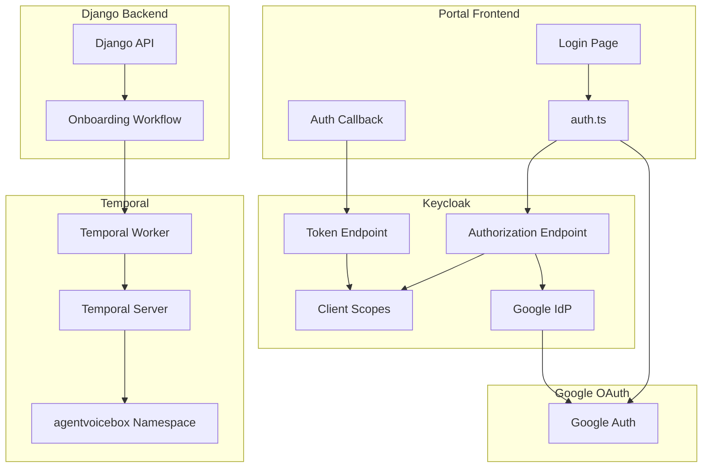

# Design Document: Keycloak OAuth and Infrastructure Fix

## Overview

This design document specifies the fixes needed for Keycloak OAuth configuration and Temporal workflow infrastructure. The implementation resolves the `Invalid scopes: openid profile email roles` error and ensures Temporal workflows are properly registered.

## Architecture



## Components and Interfaces

### 1. Keycloak Client Scopes

The Keycloak realm must define these standard OIDC client scopes:

```json
{
  "clientScopes": [
    {
      "name": "openid",
      "description": "OpenID Connect scope",
      "protocol": "openid-connect",
      "attributes": {
        "include.in.token.scope": "true",
        "display.on.consent.screen": "true"
      },
      "protocolMappers": [
        {
          "name": "sub",
          "protocol": "openid-connect",
          "protocolMapper": "oidc-sub-mapper",
          "consentRequired": false,
          "config": {}
        }
      ]
    },
    {
      "name": "profile",
      "description": "OpenID Connect profile scope",
      "protocol": "openid-connect",
      "attributes": {
        "include.in.token.scope": "true",
        "display.on.consent.screen": "true",
        "consent.screen.text": "User profile"
      },
      "protocolMappers": [
        {
          "name": "full name",
          "protocol": "openid-connect",
          "protocolMapper": "oidc-full-name-mapper",
          "consentRequired": false,
          "config": {
            "id.token.claim": "true",
            "access.token.claim": "true",
            "claim.name": "name",
            "userinfo.token.claim": "true"
          }
        },
        {
          "name": "given name",
          "protocol": "openid-connect",
          "protocolMapper": "oidc-usermodel-attribute-mapper",
          "consentRequired": false,
          "config": {
            "userinfo.token.claim": "true",
            "user.attribute": "firstName",
            "id.token.claim": "true",
            "access.token.claim": "true",
            "claim.name": "given_name",
            "jsonType.label": "String"
          }
        },
        {
          "name": "family name",
          "protocol": "openid-connect",
          "protocolMapper": "oidc-usermodel-attribute-mapper",
          "consentRequired": false,
          "config": {
            "userinfo.token.claim": "true",
            "user.attribute": "lastName",
            "id.token.claim": "true",
            "access.token.claim": "true",
            "claim.name": "family_name",
            "jsonType.label": "String"
          }
        },
        {
          "name": "username",
          "protocol": "openid-connect",
          "protocolMapper": "oidc-usermodel-attribute-mapper",
          "consentRequired": false,
          "config": {
            "userinfo.token.claim": "true",
            "user.attribute": "username",
            "id.token.claim": "true",
            "access.token.claim": "true",
            "claim.name": "preferred_username",
            "jsonType.label": "String"
          }
        }
      ]
    },
    {
      "name": "email",
      "description": "OpenID Connect email scope",
      "protocol": "openid-connect",
      "attributes": {
        "include.in.token.scope": "true",
        "display.on.consent.screen": "true",
        "consent.screen.text": "Email address"
      },
      "protocolMappers": [
        {
          "name": "email",
          "protocol": "openid-connect",
          "protocolMapper": "oidc-usermodel-attribute-mapper",
          "consentRequired": false,
          "config": {
            "userinfo.token.claim": "true",
            "user.attribute": "email",
            "id.token.claim": "true",
            "access.token.claim": "true",
            "claim.name": "email",
            "jsonType.label": "String"
          }
        },
        {
          "name": "email verified",
          "protocol": "openid-connect",
          "protocolMapper": "oidc-usermodel-attribute-mapper",
          "consentRequired": false,
          "config": {
            "userinfo.token.claim": "true",
            "user.attribute": "emailVerified",
            "id.token.claim": "true",
            "access.token.claim": "true",
            "claim.name": "email_verified",
            "jsonType.label": "boolean"
          }
        }
      ]
    }
  ]
}
```

### 2. Temporal Worker Configuration

The Temporal worker must be configured to:
1. Connect to the correct namespace
2. Register all workflows
3. Register all activities

```python
# Location: backend/temporal/worker.py

TEMPORAL_NAMESPACE = "agentvoicebox"
TEMPORAL_TASK_QUEUE = "default"

# Workflows to register
WORKFLOWS = [
    OnboardingWorkflow,
    BillingWorkflow,
    UsageAggregationWorkflow,
]

# Activities to register
ACTIVITIES = [
    create_tenant_activity,
    provision_api_keys_activity,
    setup_rate_limits_activity,
    create_lago_customer_activity,
    send_welcome_email_activity,
]
```

## Data Models

No new data models required. This fix updates configuration only.

## Correctness Properties

*A property is a characteristic or behavior that should hold true across all valid executions of a system.*

### Property 1: OAuth Scope Acceptance

*For any* valid OAuth authorization request with scopes `openid profile email roles`, Keycloak SHALL accept the request and return an authorization code without scope validation errors.

**Validates: Requirements 1.5, 3.1**

### Property 2: Token Claims Completeness

*For any* successful token exchange, the resulting access token SHALL contain all claims defined by the requested scopes (sub, name, email, roles).

**Validates: Requirements 1.1-1.4, 3.4**

### Property 3: Temporal Worker Registration

*For any* Temporal worker startup, all defined workflows and activities SHALL be registered successfully before the worker begins processing tasks.

**Validates: Requirements 4.3, 4.4, 4.5**

## Error Handling

| Error | Cause | Resolution |
|-------|-------|------------|
| `Invalid scopes` | Missing client scope definitions | Add missing scopes to Keycloak realm |
| `Namespace not found` | Temporal namespace doesn't exist | Create namespace via Temporal CLI |
| `Worker failed` | Workflow/activity registration error | Check worker logs, fix registration |

## Testing Strategy

### Unit Tests
- Verify Keycloak realm JSON is valid
- Verify all required scopes are defined
- Verify Temporal worker configuration

### Integration Tests
- Test OAuth flow end-to-end with all scopes
- Test Temporal workflow execution
- Test Google IdP authentication

