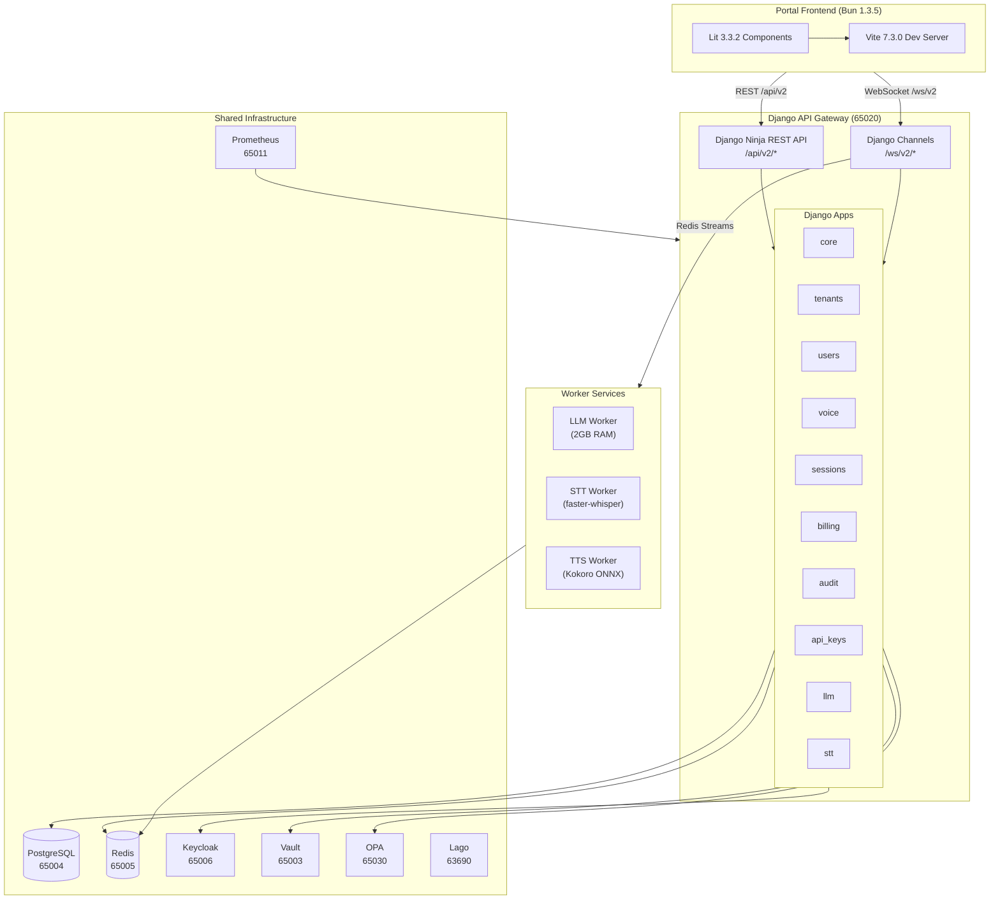

# Software Requirements Specification (SRS)
**Project**: AgentVoiceBox  
**Version**: 1.1.6  
**Date**: 2026-01-12  
**Standard**: ISO/IEC 29148:2018  
**Authors**: SOMA Engineering Team

---

## 1. Introduction

### 1.1 Purpose
This SRS specifies the complete software requirements for the **AgentVoiceBox** platform, an enterprise-grade voice AI infrastructure. This document provides an exhaustive description of all backend modules, frontend components, integrations, API contracts, and operational constraints.

### 1.2 Scope
AgentVoiceBox is a multi-tenant SaaS platform for deploying and managing voice AI agents. The system encompasses:

**Backend Stack**:
- OVOS (Open Voice OS) voice processing engine
- Django 5 + Django Ninja REST API framework
- Python 3.12 microservices architecture
- PostgreSQL for persistence
- Redis for caching and realtime messaging
- Keycloak for identity management
- Temporal for workflow orchestration

**Frontend Stack**:
- Lit 3 Web Components
- Bun 1.3.5 runtime & bundler
- Vite for development server
- Universal "Clean Light Theme" design system

### 1.3 Definitions, Acronyms, and Abbreviations

| Term | Definition |
|------|------------|
| AVB | AgentVoiceBox |
| OVOS | Open Voice OS - open-source voice assistant framework |
| STT | Speech-to-Text |
| TTS | Text-to-Speech |
| NLU | Natural Language Understanding |
| Lit | Lit 3 Web Component Framework |
| Bun | JavaScript runtime and bundler |
| ReBAC | Relationship-Based Access Control |
| OPA | Open Policy Agent |

### 1.4 References
- ISO/IEC 29148:2018 - Systems and software engineering — Life cycle processes — Requirements engineering
- [Authoritative UI SRS](../../../.kiro/specs/portal-ui-srs/requirements.md) (AVB-SRS-UI-001)
- OVOS Technical Documentation
- Django Ninja API Documentation
- Lit 3 Component Model Specification

---

## 2. Overall Description

### 2.1 Product Perspective
AgentVoiceBox is the **Voice AI pillar** of the SOMA ecosystem. It interfaces with:

- **Keycloak**: OAuth2/OIDC identity provider
- **SpiceDB**: ReBAC authorization engine
- **PostgreSQL**: Tenant data and workflow state
- **Redis**: Real-time pub/sub and caching
- **Temporal**: Durable workflow execution
- **Vault**: Secrets management
- **Kafka**: Event streaming (optional)
- **Lago**: Usage-based billing integration
- **Deepgram/Whisper**: STT/TTS cloud services

### 2.2 Product Functions

#### Core Voice Processing
1. Wake word detection and activation
2. Speech-to-text transcription
3. Intent recognition and slot filling
4. Skill execution and response generation
5. Text-to-speech synthesis
6. Multi-turn conversation management

#### SaaS Administration
1. Tenant provisioning and isolation
2. Infrastructure service configuration
3. API key and credential management
4. Billing and usage tracking
5. Audit logging and compliance
6. Theme and branding customization

#### Development & Integration
1. Workflow orchestration via Temporal
2. WebSocket real-time communication
3. REST API for tenant operations
4. Integration with external LLM providers
5. Notification delivery (email, webhook, in-app)

### 2.3 User Classes and Characteristics

| User Class | Description | Technical Proficiency |
|------------|-------------|----------------------|
| **Platform Admin** | Manages infrastructure, billing, security policies | High |
| **Tenant Admin** | Configures their organization's voice agents | Medium |
| **Developer** | Integrates AVB APIs into applications | High |
| **End User** | Interacts via voice commands | Low |

### 2.4 Operating Environment

**Backend**:
- **OS**: Linux (Docker containers)
- **Runtime**: Python 3.12
- **Database**: PostgreSQL 14+
- **Cache**: Redis 7+
- **Orchestration**: Docker Compose / Kubernetes
- **CI/CD**: Tilt for local development

**Frontend**:
- **Browser**: Chrome/Firefox/Safari (latest 2 versions)
- **Runtime**: Bun 1.3.5
- **Module System**: ES Modules
- **Build Tool**: Vite 7.3.0

### 2.5 Constraints

1. **Multi-Tenancy**: Complete data isolation between tenants
2. **Performance**: Voice response latency < 800ms (p95)
3. **Scalability**: Support 10,000+ concurrent voice sessions
4. **Security**: SOC 2 Type II compliance ready
5. **Availability**: 99.9% uptime SLA for production tier

---

## 3. Backend System Architecture

### 3.0 System Architecture Diagram



### 3.1 Django Applications

#### 3.1.1 **apps/core**
**Purpose**: Foundation layer providing shared utilities and base models.

**Modules** (29 files):
- `models.py`: Base models (TenantAwareModel, TimestampedModel)
- `permissions.py`: Permission checking utilities
- `exceptions.py`: Custom exception classes
- `middleware.py`: Request/response middleware
- `utils.py`: Common helper functions
- `validators.py`: Data validation logic
- `serializers.py`: DRF/Ninja serializers
- `tasks.py`: Background job definitions

**Key Responsibilities**:
- Tenant context management
- Database connection routing
- Authentication token validation
- CORS and security headers
- Request ID tracking
- Error handling and logging

**API Endpoints**: None (utility module)

**Dependencies**:
- Django ORM
- Django Ninja
- Redis client
- PostgreSQL driver

---

#### 3.1.2 **apps/tenants**
**Purpose**: Multi-tenant isolation and management.

**Modules** (12 files):
- `models.py`: Tenant, TenantSettings, TenantDomain
- `api.py`: Tenant CRUD operations
- `schema.py`: Pydantic schemas for tenant data
- `middleware.py`: Tenant resolution from request
- `managers.py`: TenantManager for scoped queries
- `migrations/`: Database schema versions

**Key Responsibilities**:
- Tenant creation and provisioning
- Custom domain mapping
- Tenant-scoped database queries
- Tenant settings management
- Organization hierarchy

**API Endpoints**:
- `POST /api/v2/tenants` - Create tenant
- `GET /api/v2/tenants/{id}` - Get tenant details
- `PATCH /api/v2/tenants/{id}` - Update tenant
- `DELETE / /api/v2/tenants/{id}` - Soft delete tenant
- `GET /api/v2/tenants/{id}/settings` - Get tenant settings
- `PUT /api/v2/tenants/{id}/settings` - Update settings

**Database Tables**:
- `tenants_tenant`
- `tenants_tenantsettings`
- `tenants_tenantdomain`

---

#### 3.1.3 **apps/users**
**Purpose**: User management and authentication.

**Modules** (10 files):
- `models.py`: User, UserProfile, UserSettings
- `api.py`: User CRUD and authentication endpoints
- `schema.py`: User data schemas
- `managers.py`: UserManager with Keycloak sync
- `permissions.py`: User-level permission checks
- `tasks.py`: User onboarding workflows

**Key Responsibilities**:
- User registration and profile management
- Keycloak SSO integration
- Password reset flows
- User preferences and settings
- Role assignment

**API Endpoints**:
- `POST /api/v2/auth/login` - Authenticate user
- `POST /api/v2/auth/logout` - Invalidate session
- `POST /api/v2/auth/refresh` - Refresh access token
- `GET /api/v2/users/me` - Get current user profile
- `PATCH /api/v2/users/me` - Update user profile
- `POST /api/v2/users/{id}/reset-password` - Initiate password reset

**Database Tables**:
- `users_user`
- `users_userprofile`
- `users_usersettings`

---

#### 3.1.4 **apps/voice**
**Purpose**: Core voice processing pipeline integration.

**Modules** (13 files):
- `models.py`: VoiceSession, VoiceIntent, VoiceSkill
- `api.py`: Voice session management endpoints
- `pipeline.py`: OVOS pipeline orchestration
- `stt_handler.py`: Speech-to-text processing
- `tts_handler.py`: Text-to-speech synthesis
- `intent_matcher.py`: Intent recognition logic
- `skill_executor.py`: Skill dispatch and execution
- `wake_word.py`: Wake word detection
- `audio_utils.py`: Audio format conversion

**Key Responsibilities**:
- Voice session lifecycle management
- Audio stream processing
- Intent parsing and slot extraction
- Skill execution coordination
- Response generation

**API Endpoints**:
- `POST /api/v2/voice/sessions` - Create voice session
- `WS /ws/voice/{session_id}` - WebSocket for audio streaming
- `GET /api/v2/voice/sessions/{id}` - Get session details
- `GET /api/v2/voice/intents` - List recognized intents
- `POST /api/v2/voice/tts` - Synthesize speech from text

**Database Tables**:
- `voice_voicesession`
- `voice_voiceintent`
- `voice_voiceskill`
- `voice_voiceconversation`

---

#### 3.1.5 **apps/stt**
**Purpose**: Speech-to-text service abstraction.

**Modules** (3 files):
- `providers.py`: Abstract STT provider interface
- `deepgram.py`: Deepgram integration
- `whisper.py`: OpenAI Whisper integration

**Key Responsibilities**:
- Multi-provider STT support
- Audio preprocessing
- Transcription result normalization
- Provider failover logic

**Configuration**:
- Provider priority: Deepgram (primary), Whisper (fallback)
- Supported formats: WAV, MP3, FLAC, OGG
- Streaming: Yes (WebSocket)

---

#### 3.1.6 **apps/workflows**
**Purpose**: Temporal workflow orchestration.

**Modules** (24 files):
- `activities/`: Temporal activity implementations
- `workflows/`: Temporal workflow definitions
- `models.py`: WorkflowExecution, WorkflowTemplate
- `api.py`: Workflow management endpoints
- `tasks.py`: Background workflow triggers

**Key Workflows**:
1. `tenant_onboarding`: Provision new tenant infrastructure
2. `user_registration`: Complete user signup process
3. `voice_session_recording`: Archive voice session data
4. `billing_aggregation`: Compute usage metrics
5. `notification_delivery`: Send multi-channel notifications
6. `api_key_rotation`: Rotate tenant API credentials

**API Endpoints**:
- `POST /api/v2/workflows/execute` - Start workflow
- `GET /api/v2/workflows/{id}` - Get workflow status
- `POST /api/v2/workflows/{id}/cancel` - Cancel workflow

---

#### 3.1.7 **apps/projects**
**Purpose**: Project and environment management.

**Modules** (9 files):
- `models.py`: Project, Environment, Deployment
- `api.py`: Project CRUD endpoints
- `schema.py`: Project data schemas

**Key Responsibilities**:
- Multi-environment support (dev/staging/prod)
- Project configuration management
- Deployment tracking

**API Endpoints**:
- `POST /api/v2/projects` - Create project
- `GET /api/v2/projects` - List projects
- `GET /api/v2/projects/{id}` - Get project details
- `POST /api/v2/projects/{id}/environments` - Create environment

**Database Tables**:
- `projects_project`
- `projects_environment`
- `projects_deployment`

---

#### 3.1.8 **apps/sessions**
**Purpose**: Session state management for voice interactions.

**Modules** (8 files):
- `models.py`: Session, SessionState, SessionContext
- `api.py`: Session management endpoints
- `redis_store.py`: Redis-backed session storage
- `serializers.py`: Session data serialization

**Key Responsibilities**:
- Conversation context persistence
- Session timeout management
- State synchronization across replicas

**API Endpoints**:
- `GET /api/v2/sessions/{id}` - Get session state
- `PATCH /api/v2/sessions/{id}` - Update session context
- `DELETE /api/v2/sessions/{id}` - Terminate session

---

#### 3.1.9 **apps/realtime**
**Purpose**: WebSocket server for real-time communication via Django Channels.

**Modules** (in `backend/realtime/`):
- `consumers/`: WebSocket consumer classes (EventConsumer, SessionConsumer, STTConsumer, TTSConsumer)
- `routing.py`: WebSocket URL routing
- `middleware.py`: WebSocket authentication (Keycloak JWT)

**Supported Channels** (from `routing.py`):
1. `/ws/v2/events` - Tenant/user event stream (subscribe/unsubscribe to event types)
2. `/ws/v2/sessions/{session_id}` - Real-time voice session (audio I/O, transcription, responses)
3. `/ws/v2/stt/transcription` - Streaming speech-to-text (audio chunks → text)
4. `/ws/v2/tts/stream` - Streaming text-to-speech (text → audio chunks)

**Authentication**: Keycloak JWT passed as `?token=` query param or `Authorization: Bearer` header

**Protocol**: See `docs/asyncapi.yaml` for full message schemas

---

#### 3.1.10 **apps/notifications**
**Purpose**: Multi-channel notification delivery.

**Modules** (9 files):
- `models.py`: Notification, NotificationTemplate
- `api.py`: Notification management endpoints
- `channels/`: Email, webhook, in-app channels
- `tasks.py`: Async notification delivery

**Supported Channels**:
- Email (SMTP/SendGrid)
- Webhook (HTTP POST)
- In-app (WebSocket push)
- SMS (Twilio integration)

**API Endpoints**:
- `POST /api/v2/notifications/send` - Send notification
- `GET /api/v2/notifications` - List notifications
- `PUT /api/v2/notifications/{id}/read` - Mark as read

---

#### 3.1.11 **apps/billing**
**Purpose**: Usage tracking and billing integration.

**Modules** (10 files):
- `models.py`: BillingAccount, UsageRecord, Invoice
- `api.py`: Billing endpoints
- `lago_integration.py`: Lago billing service client
- `metering.py`: Usage event recording
- `invoicing.py`: Invoice generation logic

**Key Responsibilities**:
- Track voice session usage
- Compute billable metrics
- Generate invoices via Lago
- Apply pricing tiers

**API Endpoints**:
- `GET /api/v2/billing/usage` - Get current usage
- `GET /api/v2/billing/invoices` - List invoices
- `GET /api/v2/billing/invoices/{id}/pdf` - Download PDF

---

#### 3.1.12 **apps/audit**
**Purpose**: Security audit logging.

**Modules** (8 files):
- `models.py`: AuditLog, SecurityEvent
- `api.py`: Audit log query endpoints
- `middleware.py`: Automatic request logging
- `compliance.py`: SOC2 compliance reports

**Logged Events**:
- Authentication attempts
- Permission checks
- Data access (PII)
- Configuration changes
- API key usage

**API Endpoints**:
- `GET /api/v2/audit/logs` - Query audit logs
- `GET /api/v2/audit/compliance/soc2` - Generate SOC2 report

---

#### 3.1.13 **apps/api_keys**
**Purpose**: API credential management.

**Modules** (9 files):
- `models.py`: APIKey, APIKeyScope
- `api.py`: API key CRUD endpoints
- `authentication.py`: API key authentication backend
- `permissions.py`: Scope-based authorization

**Key Responsibilities**:
- API key generation and rotation
- Scope-based permission enforcement
- Usage tracking per key
- Automatic expiration

**API Endpoints**:
- `POST /api/v2/api-keys` - Create API key
- `GET /api/v2/api-keys` - List keys
- `DELETE /api/v2/api-keys/{id}` - Revoke key
- `POST /api/v2/api-keys/{id}/rotate` - Rotate key

---

#### 3.1.14 **apps/themes**
**Purpose**: Tenant branding and theming.

**Modules** (8 files):
- `models.py`: Theme, ColorPalette, Logo
- `api.py`: Theme management endpoints
- `css_generator.py`: Dynamic CSS generation

**Key Responsibilities**:
- Custom color schemes
- Logo and favicon upload
- CSS variable injection
- White-label branding

**API Endpoints**:
- `GET /api/v2/themes/{tenant_id}` - Get tenant theme
- `PUT /api/v2/themes/{tenant_id}` - Update theme
- `POST /api/v2/themes/{tenant_id}/logo` - Upload logo

---

#### 3.1.15 **apps/llm**
**Purpose**: Large language model integration for advanced NLU.

**Modules** (4 files):
- `providers.py`: LLM provider abstraction
- `openai.py`: OpenAI GPT integration
- `anthropic.py`: Claude integration
- `prompt_builder.py`: Prompt template management

**Supported Providers**:
- OpenAI (GPT-4, GPT-3.5)
- Anthropic (Claude 3)
- Groq (Llama 3.x)
- Local models (via Ollama)

**API Endpoints**:
- `GET /api/v2/llm` - List available LLM providers
- `POST /api/v2/llm/complete` - Generate completion

---

#### 3.1.16 **apps/stt** (Additional)
**Purpose**: Speech-to-text service abstraction and API.

**API Endpoints**:
- `GET /api/v2/stt` - List available STT providers
- `POST /api/v2/stt/transcribe` - Transcribe audio file

---

#### 3.1.17 **Onboarding Router** (`apps/tenants/api_onboarding.py`)
**Purpose**: Tenant onboarding flow.

**API Endpoints**:
- `POST /api/v2/onboarding/start` - Start onboarding wizard
- `GET /api/v2/onboarding/status` - Get onboarding progress
- `POST /api/v2/onboarding/complete` - Complete onboarding

---

#### 3.1.18 **User Profile Router** (`apps/users/api_profile.py`)
**Purpose**: Current authenticated user profile operations.

**API Endpoints**:
- `GET /api/v2/user` - Get current user profile
- `PATCH /api/v2/user` - Update current user profile
- `GET /api/v2/user/preferences` - Get user preferences

---

#### 3.1.19 **Voice Cloning Router** (`apps/voice/api_voice_cloning.py`)
**Purpose**: Voice cloning and custom voice creation.

**API Endpoints**:
- `POST /api/v2/voice-cloning/upload` - Upload voice sample
- `GET /api/v2/voice-cloning/voices` - List cloned voices
- `DELETE /api/v2/voice-cloning/{id}` - Delete cloned voice

---

#### 3.1.20 **Wake Words Router** (`apps/voice/api_wake_words.py`)
**Purpose**: Wake word configuration.

**API Endpoints**:
- `GET /api/v2/wake-words` - List available wake words
- `POST /api/v2/wake-words` - Create custom wake word
- `PUT /api/v2/wake-words/{id}` - Update wake word settings

---

#### 3.1.21 **Admin Routers**
**Purpose**: SYSADMIN-only administrative endpoints.

**Registered Admin Routers**:
- `/api/v2/admin/tenants` - Admin tenant management (`apps/tenants/api_admin.py`)
- `/api/v2/admin/users` - Admin user management (`apps/users/api_admin.py`)
- `/api/v2/admin` - Admin dashboard (`apps/core/api_admin_dashboard.py`)

---

### 3.2 Integration Modules

#### 3.2.1 **integrations/keycloak.py**
**Purpose**: OAuth2/OIDC authentication via Keycloak.

**Functions**:
- `authenticate_user(username, password)` → User token
- `validate_token(access_token)` → Token claims
- `refresh_token(refresh_token)` → New access token
- `logout_user(token)` → Revoke session
- `sync_user_from_keycloak(user_id)` → Update local user record

**Configuration**:
- Keycloak realm: `agentvoicebox`
- Client ID: `portal-frontend`
- Redirect URI: `{BASE_URL}/auth/callback`

---

#### 3.2.2 **integrations/temporal.py**
**Purpose**: Temporal workflow engine integration.

**Functions**:
- `start_workflow(workflow_name, args)` → Workflow ID
- `get_workflow_status(workflow_id)` → Status object
- `cancel_workflow(workflow_id)` → Success boolean
- `query_workflow(workflow_id, query_name)` → Query result

**Connection**:
- Host: `temporal:7233`
- Namespace: `agentvoicebox`

---

#### 3.2.3 **integrations/vault.py**
**Purpose**: HashiCorp Vault secrets management.

**Functions**:
- `get_secret(path)` → Secret value
- `set_secret(path, value)` → Success boolean
- `delete_secret(path)` → Success boolean
- `rotate_database_credentials()` → New credentials

**Secrets Stored**:
- Database passwords
- API keys (Deepgram, OpenAI)
- JWT signing keys
- Encryption keys

---

#### 3.2.4 **integrations/kafka.py**
**Purpose**: Event streaming via Apache Kafka.

**Topics**:
- `voice.sessions` - Voice session events
- `billing.usage` - Usage events for metering
- `audit.logs` - Security audit stream
- `notifications.dispatch` - Notification delivery events

**Functions**:
- `publish_event(topic, event)` → Success boolean
- `subscribe(topic, handler)` → Consumer instance

---

#### 3.2.5 **integrations/lago.py**
**Purpose**: Usage-based billing via Lago.

**Functions**:
- `create_customer(tenant_id)` → Lago customer ID
- `record_usage(event)` → Success boolean
- `generate_invoice(customer_id)` → Invoice object
- `get_current_usage(customer_id)` → Usage metrics

**Billable Metrics**:
- Voice session duration (minutes)
- API calls count
- Storage usage (GB)
- Concurrent sessions (peak)

---

#### 3.2.6 **integrations/opa.py**
**Purpose**: Policy-based authorization via Open Policy Agent.

**Functions**:
- `check_permission(user, resource, action)` → Allowed boolean
- `load_policies(policy_bundle)` → Success boolean
- `evaluate_query(input_data, query)` → Decision

**Policy Examples**:
- Tenant isolation enforcement
- Feature flag authorization
- Rate limiting rules

---

#### 3.2.7 **integrations/permissions.py**
**Purpose**: SpiceDB ReBAC authorization.

**Functions**:
- `check_permission(user_id, resource, permission)` → Boolean
- `write_relationship(subject, relation, object)` → Success
- `delete_relationship(...)` → Success

**Permissions**:
- `tenant#viewer` - Read-only access
- `tenant#admin` - Full tenant management
- `project#developer` - Deploy and configure
- `session#owner` - Voice session owner

---

## 4. Frontend System Architecture

### 4.1 Technology Stack
- **Runtime**: Bun 1.3.5 (oven/bun:1.3.5-slim Docker image)
- **Framework**: Lit 3.3.2
- **Router**: @lit-labs/router 0.1.4
- **Build Tool**: Vite 7.3.0
- **Styling**: Tailwind CSS 3.4.13 (CDN in development)
- **Testing**: Playwright 1.57.0 (E2E tests)
- **Type System**: TypeScript 5.6.2

### 4.2 Directory Structure

```
portal-frontend/src/
├── components/          # Reusable Lit web components
│   ├── saas-layout.ts
│   ├── saas-glass-modal.ts
│   ├── saas-status-dot.ts
│   ├── saas-infra-card.ts
│   └── saas-config-modal.ts
├── views/               # Page-level components
│   ├── view-login.ts
│   ├── view-setup.ts
│   └── view-auth-callback.ts
├── services/            # API client services
│   ├── api-client.ts
│   ├── auth-service.ts
│   ├── admin-api.ts
│   ├── voice-api.ts
│   ├── permissions.ts
│   ├── jwt-utils.ts
│   ├── formatting.ts
│   ├── serialization.ts
│   └── hooks.ts
├── styles/              # CSS styles
├── middleware.ts        # Route guards and auth checks
└── main.ts              # Application entry point
```

### 4.3 Core Components

#### 4.3.1 **saas-layout.ts**
**Purpose**: Application shell providing header, sidebar, and content area.

**Properties**:
- `user: User | null` - Current authenticated user
- `tenant: Tenant | null` - Active tenant context
- `sidebarExpanded: boolean` - Sidebar state

**Methods**:
- `handleLogout()` - Clear session and redirect to login
- `toggleSidebar()` - Expand/collapse sidebar

**Slots**:
- `default` - Main content area
- `header-actions` - Custom header buttons

---

#### 4.3.2 **saas-glass-modal.ts**
**Purpose**: Glassmorphism-styled modal overlay for configuration dialogs.

**Properties**:
- `open: boolean` - Modal visibility state
- `title: string` - Modal title
- `width: string` - Custom width (default: '600px')

**Events**:
- `modal-close` - Fired when modal is closed

**Styling**:
- Backdrop: `backdrop-filter: blur(8px)`
- Background: `rgba(255, 255, 255, 0.9)`
- Border: `1px solid rgba(0, 0, 0, 0.1)`
- Shadow: `0 8px 32px rgba(0, 0, 0, 0.1)`

---

#### 4.3.3 **saas-status-dot.ts**
**Purpose**: Visual indicator for service/resource status.

**Properties**:
- `status: 'connected' | 'disconnected' | 'error' | 'pending'`
- `label: string` - Status text
- `pulseAnimation: boolean` - Enable pulse effect

**Styling**:
- `connected`: Green (#22c55e)
- `disconnected`: Gray (#94a3b8)
- `error`: Red (#ef4444)
- `pending`: Yellow (#eab308) with pulse

---

#### 4.3.4 **saas-infra-card.ts**
**Purpose**: Display infrastructure service connection status.

**Properties**:
- `serviceName: string` - e.g., 'PostgreSQL', 'Redis'
- `status: ServiceStatus` - Connection state
- `url: string` - Service endpoint
- `metadata: object` - Additional info (version, uptime)

**Events**:
- `configure` - Fired when configure button clicked

---

### 4.4 Views

#### 4.4.1 **view-login.ts**
**Purpose**: Minimalist OAuth login screen.

**Features**:
- OAuth provider buttons (Google, GitHub, SSO)
- Email/password fallback form
- Keycloak integration
- Redirect to `view-setup` on success

**API Calls**:
- `POST /api/v2/auth/login`

---

#### 4.4.2 **view-setup.ts**
**Purpose**: "Mother Screen" - single-page SaaS admin dashboard.

**Design Philosophy**:
- **Zero Modals**: All settings visible on one screen
- **Accordion Layout**: Progressive disclosure of settings
- **One Click**: Instant access to any service configuration

**Layout**:
- **Left Panel**: Infrastructure services status
- **Right Panel**: Configuration accordions (Zero Modals)
- **Status Indicators**: Real-time health checks

**Infrastructure Services Displayed**:
1. PostgreSQL
2. Redis
3. Keycloak
4. Temporal
5. Vault
6. Deepgram
7. OpenAI

**Tenant Operations**:
- Create new tenant
- List tenants
- Edit tenant settings
- Assign domains

**API Calls**:
- `GET /api/v2/admin/infrastructure` - Service health
- `GET /api/v2/tenants` - List tenants
- `POST /api/v2/tenants` - Create tenant

---

### 4.5 Services

#### 4.5.1 **api-client.ts**
**Purpose**: HTTP client with authentication and error handling.

**Methods**:
- `get(url, options)` → Promise<Response>
- `post(url, body, options)` → Promise<Response>
- `put(url, body, options)` → Promise<Response>
- `delete(url, options)` → Promise<Response>

**Features**:
- Automatic bearer token injection
- Refresh token rotation
- Request retry logic
- Error normalization

---

#### 4.5.2 **auth-service.ts**
**Purpose**: Authentication state management.

**Methods**:
- `login(username, password)` → User
- `logout()` → void
- `refreshToken()` → void
- `isAuthenticated()` → boolean
- `getCurrentUser()` → User | null

---

## 5. API Specification

### 5.1 Authentication Endpoints

| Method | Endpoint | Description | Request Body | Response |
|--------|----------|-------------|--------------|----------|
| POST | `/api/v2/auth/login` | Authenticate user | `{username, password}` | `{access_token, refresh_token, user}` |
| POST | `/api/v2/auth/logout` | Invalidate session | `{refresh_token}` | `{success: true}` |
| POST | `/api/v2/auth/refresh` | Refresh access token | `{refresh_token}` | `{access_token}` |

### 5.2 Tenant Management Endpoints

| Method | Endpoint | Description | Request Body | Response |
|--------|----------|-------------|--------------|----------|
| POST | `/api/v2/tenants` | Create tenant | `{name, slug, domain}` | `{id, name, slug, created_at}` |
| GET | `/api/v2/tenants` | List tenants | Query params: `?page=1&limit=20` | `{items[], total, page}` |
| GET | `/api/v2/tenants/{id}` | Get tenant details | - | `{id, name, settings, ...}` |
| PATCH | `/api/v2/tenants/{id}` | Update tenant | `{name?, domain?}` | `{id, name, ...}` |
| DELETE | `/api/v2/tenants/{id}` | Delete tenant (soft) | - | `{success: true}` |

### 5.3 Voice Session Endpoints

| Method | Endpoint | Description | Request Body | Response |
|--------|----------|-------------|--------------|----------|
| POST | `/api/v2/voice/sessions` | Create voice session | `{tenant_id, user_id}` | `{session_id, ws_url}` |
| GET | `/api/v2/voice/sessions/{id}` | Get session details | - | `{id, status, transcript, ...}` |
| WebSocket | `/ws/voice/{session_id}` | Audio streaming | Binary audio frames | Binary audio + JSON metadata |

### 5.4 Infrastructure Status Endpoint

| Method | Endpoint | Description | Response |
|--------|----------|-------------|----------|
| GET | `/api/v2/admin/infrastructure` | Get service health | `{postgres: {status, version}, redis: {...}, ...}` |

---

## 6. Non-Functional Requirements

### 6.1 Performance

| Metric | Requirement | Measurement Method |
|--------|-------------|-------------------|
| Voice Response Latency | < 800ms (p95) | End-to-end from audio input to TTS output |
| API Response Time | < 200ms (p95) | All REST endpoints except file uploads |
| Frontend Load Time | < 2s | First Contentful Paint |
| WebSocket Latency | < 100ms | Message round-trip time |
| Database Query Time | < 50ms (p95) | Per query execution time |

### 6.2 Scalability

| Dimension | Target | Notes |
|-----------|--------|-------|
| Concurrent Voice Sessions | 10,000+ | With horizontal scaling |
| API Requests/Second | 50,000+ | Per cluster |
| Tenants | 100,000+ | With database sharding |
| Users per Tenant | 10,000+ | No hard limit |

### 6.3 Security

**Authentication**:
- OAuth 2.0 via Keycloak
- JWT with RS256 signing
- Token rotation every 15 minutes
- Refresh tokens valid for 7 days

**Authorization**:
- ReBAC via SpiceDB
- Row-level security in PostgreSQL
- API scopes per key
- Policy enforcement via OPA

**Data Protection**:
- TLS 1.3 for all connections
- Encrypted database columns (PII)
- Vault for secrets management
- Audit logging for all data access

**Compliance**:
- GDPR ready (data deletion, export)
- SOC 2 Type II audit trail
- CCPA compliance

### 6.4 Reliability

| Requirement | SLA | Implementation |
|-------------|-----|----------------|
| Uptime | 99.9% | Multi-AZ deployment, health checks |
| Data Durability | 99.999999999% | PostgreSQL replication, S3 backups |
| Disaster Recovery | RPO: 15min, RTO: 1hr | Automated backups, failover |
| Error Rate | < 0.1% | Circuit breakers, retries |

### 6.5 Observability

**Metrics**:
- Prometheus for metrics collection
- Custom dashboards per module

**Logging**:
- Structured JSON logs
- Centralized via Loki/ELK
- Log retention: 90 days

**Tracing**:
- OpenTelemetry distributed tracing
- Jaeger for trace visualization
- End-to-end request tracking

**Alerting**:
- PagerDuty integration
- Alert on SLA violations
- On-call rotation support

---

## 7. Data Models

### 7.1 Core Entities

#### Tenant
```python
class Tenant:
    id: UUID
    name: str
    slug: str  # URL-safe identifier
    domain: str | None  # Custom domain
    created_at: datetime
    settings: dict  # JSON configuration
    is_active: bool
    subscription_tier: str  # free, pro, enterprise
```

#### User
```python
class User:
    id: UUID
    email: str
    full_name: str
    tenant_id: UUID
    keycloak_id: str
    roles: list[str]
    created_at: datetime
    last_login: datetime
```

#### VoiceSession
```python
class VoiceSession:
    id: UUID
    tenant_id: UUID
    user_id: UUID
    status: str  # active, completed, error
    started_at: datetime
    ended_at: datetime | None
    transcript: str
    audio_url: str | None  # Archived audio file
    metadata: dict
```

#### APIKey
```python
class APIKey:
    id: UUID
    tenant_id: UUID
    name: str
    key_hash: str  # SHA-256
    scopes: list[str]
    created_at: datetime
    expires_at: datetime | None
    last_used_at: datetime | None
```

---

## 8. Deployment Architecture

### 8.1 Container Images (from `docker-compose.yml`)

| Service | Container Name | Base Image | Port | RAM Limit | Health Check |
|---------|---------------|------------|------|-----------|--------------|
| `django-api` | `avb-django-api` | `python:3.12-slim` | 65020 | 1.5GB | `/health/` |
| `portal-frontend` | `avb-portal-frontend` | `oven/bun:1.3.5-slim` | 65027 | 512MB | `/` |
| `worker-llm` | `avb-worker-llm` | Python container | - | 2GB | N/A |
| `worker-stt` | `avb-worker-stt` | faster-whisper | - | 1.5GB | N/A |
| `worker-tts` | `avb-worker-tts` | kokoro ONNX | - | 1GB | N/A |

**Total RAM Budget**: ~7GB for AgentVoiceBox + 8GB for shared services = 15GB

### 8.2 Tilt Development Orchestration

**Tiltfile** orchestrates:
1. Backend services via `docker-compose.test.yml`
2. Frontend dev server via `docker-compose.frontend.yml`
3. Live sync of code changes
4. Automatic rebuild on file changes

**Services Started by Tilt**:
- PostgreSQL
- Redis
- Keycloak
- Temporal
- Vault
- Backend API
- Frontend dev server

---

## 9. Testing Requirements

### 9.1 Backend Tests

**Unit Tests** (pytest):
- 80%+ code coverage
- All models, serializers, utilities
- Mock external services

**Integration Tests**:
- API endpoint contracts
- Database queries
- Keycloak authentication flow
- Temporal workflow execution

**E2E Tests** (Playwright):
- Full voice session flow
- Tenant creation and configuration
- User authentication

### 9.2 Frontend Tests

**Component Tests** (Web Test Runner):
- All Lit components
- Event handling
- Property reactivity

**E2E Tests** (Playwright):
- Login flow
- SaaS setup dashboard
- Modal interactions
- API error handling

---

## 10. Verification & Validation

### 10.1 Acceptance Criteria

**Voice Processing**:
- ✅ Voice session completes in < 800ms
- ✅ STT accuracy > 95% on standard test corpus
- ✅ TTS output is natural and clear

**Multi-Tenancy**:
- ✅ Complete data isolation verified
- ✅ Tenant cannot access other tenant data
- ✅ Cross-tenant queries return 403 Forbidden

**Authentication**:
- ✅ OAuth flow works with all providers
- ✅ Token refresh works seamlessly
- ✅ Logout invalidates all tokens

**Frontend**:
- ✅ All components render without errors
- ✅ Modal interactions work smoothly
- ✅ Infrastructure status updates in real-time

### 10.2 Manual Verification

1. Run `tilt up` in `AgentVoiceBoxEngine/`
2. Verify all services show as "healthy"
3. Navigate to `http://localhost:3000`
4. Complete login flow
5. Verify "Mother Screen" displays infrastructure status
6. Create a test tenant
7. Initiate a voice session
8. Verify audio transcription appears

---

## 11. Maintenance & Support

### 11.1 Backup Strategy
- PostgreSQL: Continuous WAL archiving + daily snapshots
- Redis: RDB snapshots every 5 minutes
- Vault: Encrypted snapshots to S3
- Audio files: Immutable S3 storage with versioning

### 11.2 Monitoring
- Prometheus alerting rules
- PagerDuty escalation policies
- Weekly SRE review meetings

### 11.3 Documentation
- API documentation via Swagger/OpenAPI
- Component documentation via Storybook
- Architecture diagrams in `docs/architecture/`
- Runbooks in `docs/runbooks/`

---

**END OF AGENTVOICEBOX SRS v1.0.0**
