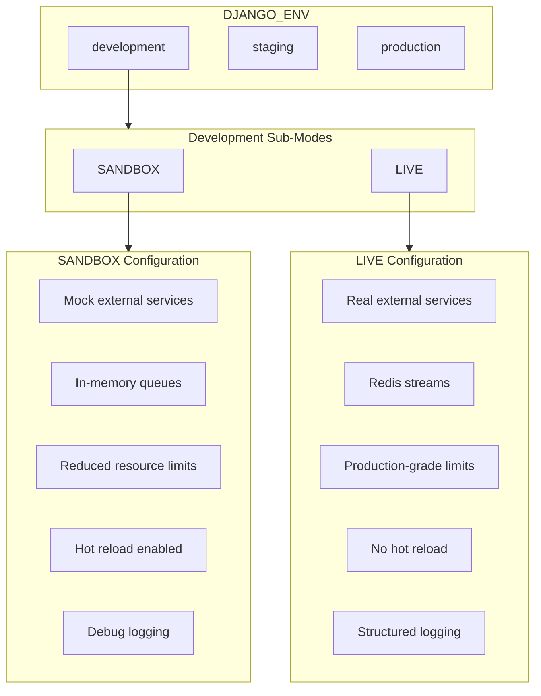

# SaaS Developer Mode Configuration SRS

**Version**: 1.0.1  
**Date**: 2026-01-12  
**Compliance**: ISO/IEC 29148:2018
**Status**: PLANNED (Not Implemented)

---

## 1. Purpose

This document specifies the **SANDBOX** and **LIVE** development modes for the AgentVoiceBox SaaS deployment. These modes exist **ONLY IN DEVELOPMENT** and provide production-grade configurations with local resource constraints.

**Current implementation note**: The sandbox/live sub-modes are not implemented in the codebase or compose
files yet. The runtime currently uses standard Django settings and the shared-services/application stack
layout.

---

## 2. Mode Architecture



---

## 3. Environment Variable

| Variable | Values | Default |
|----------|--------|---------|
| `AVB_DEV_MODE` | `sandbox`, `live` | `sandbox` |

> [!IMPORTANT]
> `AVB_DEV_MODE` is **ONLY** read when `DJANGO_ENV=development`
> In staging/production, this variable is IGNORED.

**Implementation status**: No runtime settings currently read `AVB_DEV_MODE`.

---

## 4. SANDBOX Mode

### 4.1 Purpose
Rapid local development with minimal resource requirements and mocked services.

### 4.2 Resource Limits

| Service | Memory | CPU | Volumes |
|---------|--------|-----|---------|
| Django API | 512MB | 0.5 | tmpfs |
| Portal Frontend | 256MB | 0.25 | tmpfs |
| Worker LLM | 512MB | 0.5 | tmpfs |
| Worker STT | 256MB | 0.25 | tmpfs |
| Worker TTS | 256MB | 0.25 | tmpfs |
| **Total** | **1.75GB** | **1.75** | **None** |

### 4.3 Service Configuration

| Service | SANDBOX Behavior |
|---------|------------------|
| PostgreSQL | Local container (65004) |
| Redis | Local container (65005) |
| Keycloak | **BYPASSED** - Mock JWT tokens |
| Vault | **BYPASSED** - Env vars only |
| Temporal | **DISABLED** - Direct function calls |
| OPA | **DISABLED** - All policies pass |
| Kafka | **DISABLED** - In-memory events |
| Lago | **MOCKED** - Fake billing responses |

### 4.4 Django Settings (Planned)

Planned: dedicated `config/settings/sandbox.py` does not exist yet.

---

## 5. LIVE Mode

### 5.1 Purpose
Production-grade local environment for integration testing and pre-deployment validation.

### 5.2 Resource Limits

| Service | Memory | CPU | Volumes |
|---------|--------|-----|---------|
| Django API | 1.5GB | 1.0 | Persistent |
| Portal Frontend | 512MB | 0.5 | Persistent |
| Worker LLM | 2GB | 1.0 | Persistent |
| Worker STT | 1.5GB | 1.0 | Persistent |
| Worker TTS | 1GB | 0.5 | Persistent |
| **Total** | **6.5GB** | **4.0** | **Yes** |

### 5.3 Service Configuration

| Service | LIVE Behavior |
|---------|---------------|
| PostgreSQL | Local container - 65004 (persistent) |
| Redis | Local container - 65005 (persistent) |
| Keycloak | Local container - 65006 (full auth) |
| Vault | Local container - 65003 (full secrets) |
| Temporal | Local container - 65007 (full workflows) |
| OPA | Local container - 65030 (full policies) |
| Kafka | **DISABLED** (not required for SaaS) |
| Lago | Isolated cluster - 63690 (full billing) |

### 5.4 Django Settings (Planned)

Planned: dedicated `config/settings/live.py` does not exist yet.

---

## 6. Docker Compose Profiles (Planned)

### 6.1 Profile Selection

Planned: no compose profiles exist in the current `docker-compose.yml`.

### 6.2 Profile Definition

Planned: profile definitions are not present in the current compose files.

---

## 7. Environment Files (Planned)

### 7.1 File Structure

Planned: `.env.sandbox` and `.env.live` are not present in the repo.

### 7.2 Mode-Specific Variables

| Variable | SANDBOX | LIVE |
|----------|---------|------|
| `AVB_DEV_MODE` | `sandbox` | `live` |
| `DEBUG` | `true` | `true` |
| `KEYCLOAK_BYPASS` | `true` | `false` |
| `VAULT_FAIL_FAST` | `false` | `true` |
| `OPA_ENABLED` | `false` | `true` |
| `LOG_LEVEL` | `DEBUG` | `INFO` |
| `AVB_API_MEMORY` | `512M` | `1536M` |

---

## 8. Portal Frontend Integration

### 8.1 Mode Indicator (Development Only)

The portal displays a mode badge in DEVELOPMENT:

```
┌─────────────────────────────────────┐
│  🧪 SANDBOX MODE                    │
│  ─────────────────                  │
│  Auth: Bypassed                     │
│  Billing: Mocked                    │
│  Workflows: Disabled                │
└─────────────────────────────────────┘
```

### 8.2 Mode Toggle API

```
GET /api/v2/system/dev-mode
Response: { "mode": "sandbox", "features": {...} }

POST /api/v2/system/dev-mode  (DEV ONLY)
Body: { "mode": "live" }
```

> [!WARNING]
> Mode toggle endpoint is **DISABLED** in staging/production.

---

## 9. Implementation Tasks

| ID | Task | Priority |
|----|------|----------|
| DM-001 | Create `sandbox.py` settings module | P1 |
| DM-002 | Create `live.py` settings module | P1 |
| DM-003 | Add `AVB_DEV_MODE` to settings_config.py | P1 |
| DM-004 | Create `.env.sandbox` and `.env.live` | P1 |
| DM-005 | Update docker-compose with profiles | P1 |
| DM-006 | Add mode indicator to portal | P2 |
| DM-007 | Implement mode toggle API (dev only) | P2 |

---

## 10. Verification

### 10.1 SANDBOX Verification
```bash
AVB_DEV_MODE=sandbox docker compose --profile sandbox up
curl http://localhost:65020/health/
# Should return: {"status": "healthy", "mode": "sandbox"}
```

### 10.2 LIVE Verification
```bash
AVB_DEV_MODE=live docker compose --profile live up
curl http://localhost:65020/health/
# Should return: {"status": "healthy", "mode": "live"}
# Keycloak, Vault, OPA should all be UP
```

---

**Document Status**: READY FOR REVIEW
