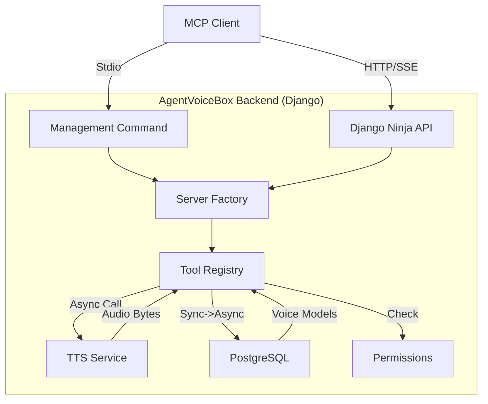

# AgentVoiceBox MCP Architecture Specification

**Document ID**: AVB-SRS-MCP-001  
**Version**: 1.1.0  
**Date**: 2026-01-13  
**Status**: APPROVED  
**Compliance**: ISO/IEC 29148:2018, VIBE Coding Rules

---

## 1. Introduction

### 1.1 Purpose
This document specifies the architecture and implementation details for the **Model Context Protocol (MCP)** integration within the AgentVoiceBox platform. It defines how AgentVoiceBox exposes its internal capabilities (Voice, Billing, Realtime) as standardized MCP Tools and Resources using a strict Native Django approach.

### 1.2 Scope
*   **In Scope**: 
    *   **Native Django Implementation**: Uses `apps.mcp` with `FastMCP` pattern.
    *   **Transports**:
        *   **Stdio**: For local IDE integration (Cursor/Windsurf) via `python manage.py run_mcp_server`.
        *   **SSE**: For remote agent connectivity via `/api/v2/mcp/sse`.
    *   **Tool Wrappers**: Wrapping `apps.voice`, `apps.billing` service layers.
    *   **Security**: Leveraging existing Keycloak JWT and API Key infrastructure.
*   **Out of Scope**: 
    *   Client-side implementation (AgentVoiceBox acts solely as the Server).

---

## 2. Architecture

### 2.1 Component Diagram

### 2.2 Technology Stack
*   **Language**: Python 3.12+
*   **Framework**: Django 5.x (Native App: `apps.mcp`)
*   **Libraries**:
    *   `mcp` (Official SDK)
    *   `temporalio` (Workflow Orchestration)
    *   `kokoro` (TTS Engine)
    *   `asgiref` (Sync-to-Async bridging)

---

## 3. Functional Requirements

### 3.1 Server Factory
*   [REQ-MCP-001] The system SHALL implement a centralized `server_factory.py` to ensure identical toolsets across Stdio and SSE transports.
*   [REQ-MCP-002] The server factory SHALL initialize `FastMCP` with the name "AgentVoiceBox".

### 3.2 Transports
*   [REQ-MCP-003] **Stdio**: The system SHALL provide `python manage.py run_mcp_server --transport stdio` for local pipe-based communication.
*   [REQ-MCP-004] **SSE**: The system SHALL expose `GET /api/v2/mcp/sse` (Event Stream) and `POST /api/v2/mcp/messages` (JSON-RPC) via Django Ninja.

### 3.3 Core Tools
The system SHALL expose the following initial tools:

1.  **`list_voices`**
    *   **Description**: Lists available TTS voices.
    *   **Source**: `apps.voice.services.VoiceModelService.list_models`
    *   **Wrappers**: Must use `sync_to_async` for database access.

2.  **`generate_speech`**
    *   **Description**: Synthesizes speech from text.
    *   **Inputs**: `text` (str), `voice_id` (str, default="af_heart").
    *   **Source**: `apps.workflows.activities.tts.TTSActivities`.
    *   **Output**: Base64 encoded WAV audio.

3.  **`get_server_status`**
    *   **Output**: "AgentVoiceBox Platform is ONLINE".

---

## 4. Security Requirements (VIBE Zero Trust)

*   [SEC-MCP-001] **No Hardcoded Secrets**: All credentials must be retrieved from Vault or Environment Variables.
*   [SEC-MCP-002] **Async Safety**: All Database interactions in MCP tools MUST be explicitly wrapped in `sync_to_async` to prevent the `SynchronousOnlyOperation` error in the async server loop.
*   [SEC-MCP-003] **Strict Typing**: All Tool inputs and outputs MUST be strictly typed (Pydantic models or Python type hints) to ensure MCP protocol compliance.

---

## 5. Verification
*   **Script**: `backend/verify_mcp_real_infra.py`
*   **Coverage**:
    *   Infrastructure Connectivity (Postgres, Redis).
    *   Database Schema (Migrations).
    *   Data Persistence (Seeding).
    *   Tool Logic Execution.
